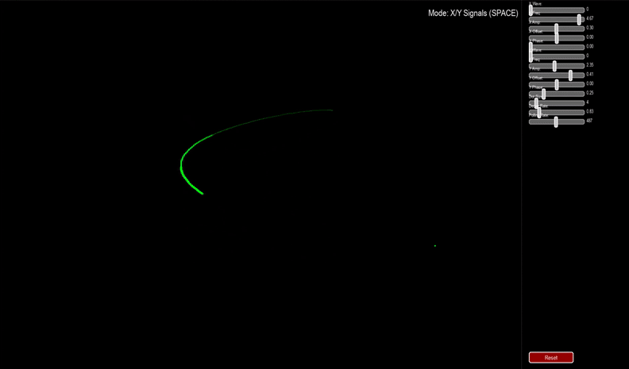

# 🎛️ Simple Oscilloscope Simulator

An interactive waveform visualizer built with Pygame, allowing real-time simulation of dynamic signal paths using mouse input or procedural signal generators. Customize frequency, amplitude, decay, and waveform types to create mesmerizing motion trails.

---

## 📽️ Demo

> **Toggle between drawing modes with the `SPACE` key:**
>
> * ✍️ **Mouse Mode**: Draw manually by moving the cursor.
> * 📡 **Signal Mode**: Simulate Lissajous-style patterns using configurable X/Y signals.

---

## 🧠 Features

* 🟢 **Real-Time Trail Rendering**: Smooth, glowing trails created from adjustable spots.
* ⚙️ **Dynamic Signal Generation**:

  * Select waveform types: `Sine`, `Square`, `Sawtooth`, `Triangle`.
  * Tweak signal parameters: `Frequency`, `Amplitude`, `Offset`, and `Phase`.
* 🎚️ **Customizable Decay & Size**: Adjust spot fading and size for visual style control.
* 🔁 **Reset Button**: Instantly revert all controls to default.
* 🖱️ **Responsive GUI Sliders**: Fine-tune parameters with drag-friendly sliders.
* ⏱️ **Adjustable Polling Rate**: Control how frequently signal points are sampled.

---

## 🎮 Controls

| Key / UI       | Action                                    |
| -------------- | ----------------------------------------- |
| `SPACE`        | Toggle between Mouse and Signal mode      |
| Sliders        | Adjust parameters (wave, freq, amp, etc.) |
| `Reset` Button | Revert all sliders to default values      |

---

## 🛠️ Requirements

* Python 3.7+
* [`pygame`](https://www.pygame.org/)

Install dependencies via pip:

```bash
pip install pygame
```

---

## 🚀 Running the Project

```bash
python run.py
```

---

## 🧩 Code Structure

* `Spot`: Represents a glowing dot that fades over time.
* `SignalGenerator`: Generates X and Y positions using waveform math.
* `Slider`: GUI element for user control.
* `ChannelControls`: Bundles signal controls for each axis.
* `Button`: Basic UI button to reset parameters.
* `main()`: Initializes the app, runs event loop, handles rendering.

---

## 📷 Screenshots



---

## 🧪 Future Work

* Save/load custom presets
* Export signal patterns
* Add audio-reactive input
* More waveform types

---

## 📄 License

MIT License. See `LICENSE` for details.


